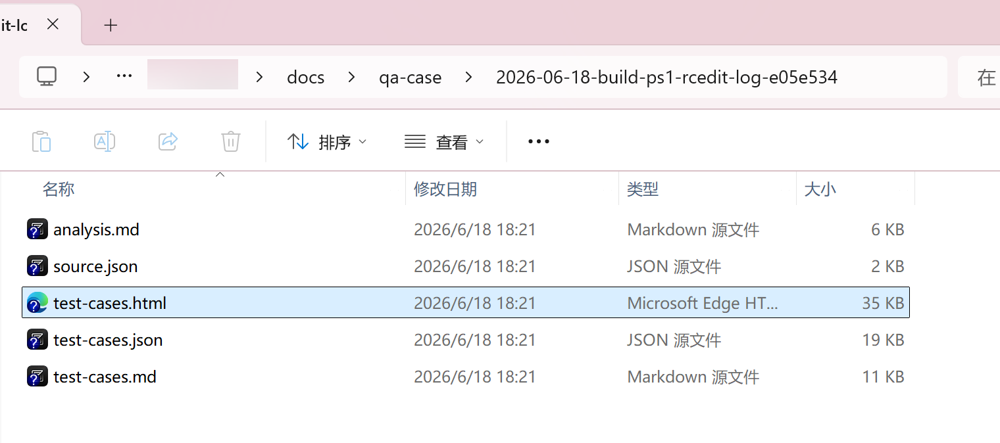

# Skills for daily code workflow

在日常开发工作里沉淀出来的skills。

这些 skill 本质上是一组可复用的 agent 工作流：把高频、复杂、容易遗漏上下文，或需要审计记录的开发动作整理成明确流程，让 agent 可以更稳定地复用经验、检查事实、生成产物，从而提升日常研发效率。

仓库里的每个顶层目录通常都是一个可分发的 skill 包，包含：

- 可安装的内层 skill 目录。
- 面向使用者的 `README.md` 和 `INSTALL.md`。
- skill 自身的 `SKILL.md`、参考资料、脚本或模板资产。
- 必要时附带 `samples/` 示例截图或输出样例。

## 当前 Skills

### coding-workflow

[coding-workflow](coding-workflow/README.md) 是一组用于 PRD 驱动开发交付的 Codex skills，包含 `setup-workflow` 和 `implement-with-prd` 两个显式调用入口。

它适合把需求讨论、PRD 沉淀和代码交付拆开管理：先用 `setup-workflow` 在目标仓库安装稳定的 `docs/coding-workflow/` 工作流协议，再用 `implement-with-prd` 基于明确 PRD 启动一次交付流程，生成 delivery 工作区和第一个 Build Worker prompt。

安装说明见 [coding-workflow/INSTALL.md](coding-workflow/INSTALL.md)。

### commit-qa-cases

[commit-qa-cases](commit-qa-cases/README.md) 用来根据 commit、diff、工作区改动或功能需求生成 QA 测试用例资产。

它会分析当前仓库行为，输出业务影响分析、覆盖矩阵、结构化测试用例、Markdown 文档，并可渲染交互式 HTML 测试执行页面。

安装说明见 [commit-qa-cases/INSTALL.md](commit-qa-cases/INSTALL.md)。

### intent-cherry-pick

[intent-cherry-pick](intent-cherry-pick/README.md) 用来做“按源码事实保真”的 commit 移植。

它适合普通 `git cherry-pick` 过于机械的分支移植场景，会先锁定源 commit 事实和目标分支事实，再按确认过的意图进行融合，并生成审计记录。

安装说明见 [intent-cherry-pick/INSTALL.md](intent-cherry-pick/INSTALL.md)。

## 示例：commit-qa-cases

使用 `$commit-qa-cases` 时，可以直接让 agent 基于某个 commit 或当前工作区改动生成 QA 用例：

```text
Use $commit-qa-cases to analyze the current working-tree changes and generate archived QA cases.
```

输入提示示例：


生成的交互式 HTML 测试页面：


生成的归档资产：



## 使用方式

进入具体 skill 目录，按对应 `INSTALL.md` 把内层 skill 目录复制到本机 Codex skills 目录。

安装后重启 Codex，或开启一个新 thread，让 skill 列表刷新。使用时在提示词里显式写出 skill 名，例如：

```text
使用 $commit-qa-cases，基于 commit c85a700 生成 QA 测试用例。
```

```text
使用 $intent-cherry-pick，把 pc_dev_feature 上的 f437cc373 合入 pc_main。
```

```text
使用 $setup-workflow 初始化这个仓库的 coding workflow 文档。
```

```text
使用 $implement-with-prd，基于 docs/prds/<prd-file>.md 启动 coding workflow。
```
